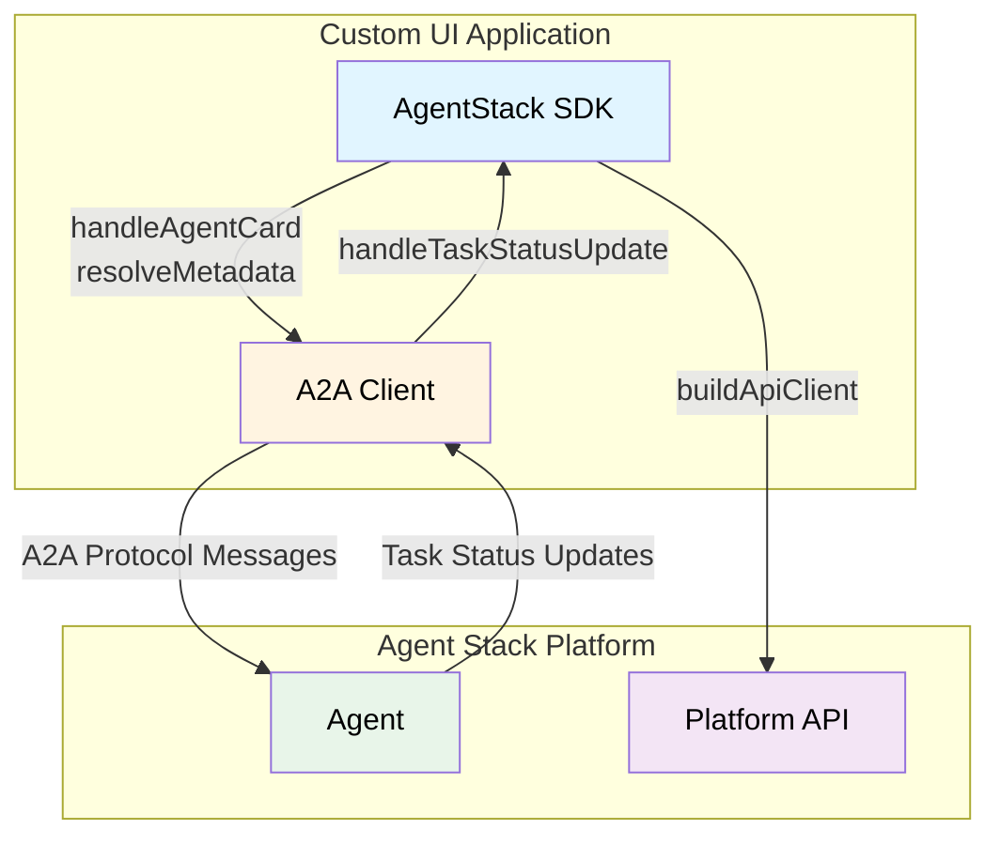

The Agent Stack TypeScript Client SDK simplifies building custom UIs for A2A agents. It handles agent service demands, maps task status updates to UI actions, and provides a typed platform API client. Use it to fulfill agent requirements, render interactive elements like forms and approvals, and manage communication between your UI and Agent Stack.

It builds on the [Agent2Agent Protocol (A2A)](https://a2a-protocol.org/) and provides two layers:

1. A2A extensions and helpers that translate agent card demands such as LLM access, embeddings, OAuth, and secrets into client fulfillments like API keys, model choices, redirect URIs, and secret values, plus UI metadata.
2. A platform API client that talks to the AgentStack server.

The SDK also exports A2A protocol types and Zod schemas so your UI can stay in sync with the protocol.

## What the SDK Exports

The public surface of the SDK is grouped into four entrypoints:

1. `agentstack-sdk` for everything
2. `agentstack-sdk/api` for platform API client, schemas, and types
3. `agentstack-sdk/core` for extension helpers and A2A interaction utilities
4. `agentstack-sdk/extensions` for A2A extension definitions and types



## Core Workflows

### 1. Create an A2A client

Create a context token for the session and pass it to the A2A client fetch. The token is required to fetch the agent card and stream messages. See **[Permissions and Tokens](./permissions-and-tokens)** for context token creation.

```typescript
import {
  ClientFactory,
  ClientFactoryOptions,
  DefaultAgentCardResolver,
  JsonRpcTransportFactory,
} from "@a2a-js/sdk/client";
import { createAuthenticatedFetch } from "agentstack-sdk";

const fetchImpl = createAuthenticatedFetch(contextToken.token);
const factory = new ClientFactory(
  ClientFactoryOptions.createFrom(ClientFactoryOptions.default, {
    transports: [new JsonRpcTransportFactory({ fetchImpl })],
    cardResolver: new DefaultAgentCardResolver({ fetchImpl }),
  }),
);

const agentCardPath = `api/v1/a2a/${providerId}/.well-known/agent-card.json`;
const client = await factory.createFromUrl(baseUrl, agentCardPath);
```

See **[A2A Client Integration](./a2a-client)** for a complete setup.

### 2. Handle agent card demands

Agents declare service demands in their agent card. Use `handleAgentCard` to read those demands and produce metadata fulfillments.

```typescript
import { handleAgentCard } from "agentstack-sdk";

const { demands, resolveMetadata } = handleAgentCard(agentCard);

const metadata = await resolveMetadata({
  llm: async (llmDemands) => {
    return {
      llm_fulfillments: {
        default: {
          identifier: "llm_proxy",
          api_base: "{platform_url}/api/v1/openai/",
          api_key: contextToken.token,
          api_model: "gpt-4o",
        },
      },
    };
  },
});
```

Use `buildMessageBuilder(agentCard)` when you want a helper that turns a user message into a fully formed A2A message with metadata.

### 3. Stream task status updates into UI actions

When you stream A2A task events, `handleTaskStatusUpdate` maps status updates into actionable UI events.
It focuses on `auth-required` and `input-required` states, which cover OAuth, secrets, forms, and approvals.

```typescript
import { handleTaskStatusUpdate, TaskStatusUpdateType } from "agentstack-sdk";

for await (const event of stream) {
  if (event.kind === "status-update") {
    for (const update of handleTaskStatusUpdate(event)) {
      if (update.type === TaskStatusUpdateType.FormRequired) {
        // Render update.form
      }
    }
  }
}
```

<Tip>
  **Why task status updates for chat streaming**

  1. A2A uses tasks to represent long running work so you can track progress and cancel.
  2. Status updates provide the incremental channel for UI events and streaming output.
  3. Each streamed token arrives as a `TaskStatusUpdate`, so you can append text as it arrives.
</Tip>

### 4. Build user metadata

When the user responds to forms, approvals, or canvas requests, use `resolveUserMetadata` to build message metadata.

<Tip>
  **User metadata**

  User metadata is the structured response payload that you attach to a message. It is separate from text parts and lets the agent consume form fields, approvals, and canvas actions in a typed way.
</Tip>

```typescript
import { resolveUserMetadata } from "agentstack-sdk";

const metadata = await resolveUserMetadata({
  form: { name: "Ada" },
  approvalResponse: { decision: "approve" },
});
```

### 5. Use the platform API client

`buildApiClient` exposes the platform API with typed responses and runtime validation.
Use the user access token from your identity provider for UI side API calls. Context tokens are scoped for agent use and can also authenticate to the platform API when running inside the agent. See **[Permissions and Tokens](./permissions-and-tokens)** for token types and scopes.

```typescript
import { buildApiClient, createAuthenticatedFetch } from "agentstack-sdk";

const api = buildApiClient({
  baseUrl: "https://your-agentstack-instance.com",
  fetch: createAuthenticatedFetch(accessToken),
});
```

All API calls return `ApiResult<T>`. Use `unwrapResult` if you want exceptions, and then handle errors with `isHttpError`, `isNetworkError`, `isParseError`, and `isValidationError`.

## Protocol Types and Schemas

The SDK exports A2A protocol types and Zod schemas that match the AgentStack UI usage, including:

- `Message`, `Part`, and `Task` types
- `TaskStatusUpdateEvent` and `TaskArtifactUpdateEvent`
- UI and service extension schemas

These exports are useful when building strongly typed UI layers or validating inbound messages.

## Next Steps

- **[Agent Requirements](./agent-requirements)** for service and UI extension handling
- **[Platform API Client](./platform-api-client)** for endpoint reference and error helpers
- **[Error Handling](./error-handling)** for platform and extension error patterns
- **[User Messages](./user-messages)** for composing user messages with metadata
- **[A2A Client Integration](./a2a-client)** for end to end streaming with `@a2a-js/sdk`
